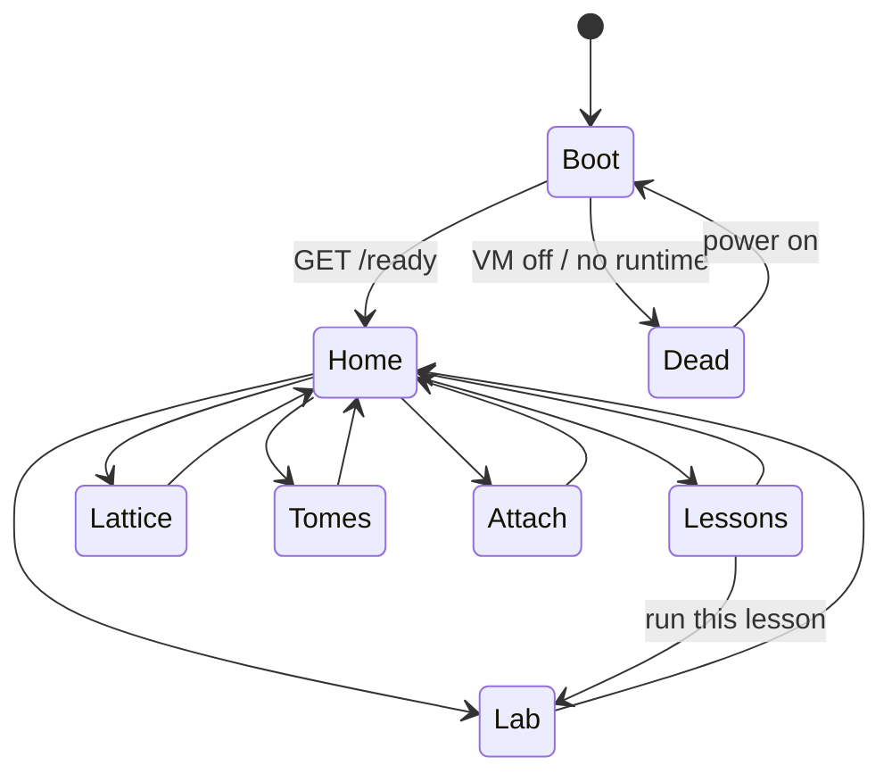

<!-- hal:authoritative:yaml -->

# HedronOS (in a HedronVM)

The student boots an OS. They do not run Docker.

`install.sh` + Compose are the firmware. ratatui is the machine they sit at. If they can tell the lab is "a compose stack with a TUI skin," this pass failed.

Lives in `ideas/academy/`. Not Foundry. No GitHub repo until Evan says. OpenTofu is later. No k3s, no Tailscale, no tome PDFs in the image, no mesh IPs. Do not host this on citadel or apiary.

Lanes: Marci = OS metaphor + screen map + first flow. Sati = visual law. Jupi = compose / `install.sh` / crate.

## Metaphor

| they say | it is |
|----------|--------|
| HedronOS | the terminal machine. PID they live in. |
| HedronVM | whatever runs containers on their laptop (Docker Desktop, Colima, Orb). Invisible after boot. |
| kernel | one Compose service: lattice (SQLite + DuckDB) + lesson fetchd + `lab` CLI |
| consoles | screens. Not tabs. Not a web app. |
| processes | a lesson fetch, a lab run, an attached bot |
| disk | `vault/` (Obsidian) and `seed/lattice.db` |
| network | localhost only. 8 GB laptop floor. |

Boot copy (placeholder, Sati rewrites): `HEDRONOS 0.1 — student lab. Not the mesh.`

They never see `docker compose` after the first install. Re-open is `hedronos` (the binary). If Compose is down, boot says the VM is powered off and offers `power on` (which is `compose up -d` under the glass).

## Screen map



Keys this pass (crossterm): `h` home, `l` lessons, `r` lab runner, `d` disk/lattice, `t` tomes, `a` attach, `q` quit. Esc pops to home. No mouse required. Sati owns chrome; these are bindings only.

### Boot

Full-frame. No chrome. Sequence: detect runtime → wait for `GET localhost:<lab>/ready` → mount vault path → drop into Home.

If no runtime: one line, one action (`power on` / `install runtime`). Do not dump brew help into the framebuffer. `install.sh` already did the long path.

Feel: firmware POST, not a spinner over compose logs.

### Home

The desktop. Six consoles as a 2×3 (or 1-col if the tty is narrow), plus a one-line status: OS version, lattice row count, lesson feed freshness, attached-bot yes/no.

This is the only screen that may look like a launcher. Everything else is a room.

### Lessons

Feed from **https://hedronite.com** (main, not staging). Fetcher lives in the container. TUI renders titles + a text body (HTML stripped to blocks). No embedded browser. No staging host.

Select a lesson → read. `r` hands the lesson id to Lab.

Offline: last fetch on disk. Never bake lesson HTML into the image.

### Lab

Runner. Pick a job from the current lesson (or a demo job from the seed). stdout/stderr in a scrolling pane. One job at a time this pass (the laptop is the floor).

The TUI talks to `lab` inside the container (HTTP or `docker compose exec` hidden). It does not shell out to `docker compose` in the status line.

### Lattice

Disk console. SQLite `lattice.db` + DuckDB. Schema + demo rows only. Not Evan's Akasha.

Two panes: tables / a read-only query box with three canned statements. Writes wait.

### Tomes

`checklists/tomes.md` only. Buy/borrow. No PDF bytes. If a lesson needs a book, this console names it.

### Attach

The student's bot is a process on this OS, not a Hedronite agent we ship.

Show: folder path, the `@hedronite-lab` / `skill.md` prompt, "your Grok / Cursor / Cowork attaches here." No OAuth. No Eli, no Leo.

If nothing is attached, the console still looks like a tty waiting for a login, not a settings form.

## First crate / compose shape

No repo yet. This is the tree Jupi scaffolds when Evan says clone.

```
hedronite-lab/
  README.md
  install.sh                 # Jupi. laptop path. idempotent
  skill.md                   # one-prompt attach
  compose.yaml               # one service day one
  vault/                     # Obsidian-ready, empty lattice notes
  seed/lattice.db            # schema + demo
  checklists/tomes.md
  crates/
    hedronos/                # the OS. Marci flow, Sati chrome
      Cargo.toml
      src/
        main.rs              # crossterm + ratatui loop
        os.rs                # App, Console enum, tick
        consoles/
          boot.rs
          home.rs
          lessons.rs
          lab.rs
          lattice.rs
          tomes.rs
          attach.rs
        widgets/             # impl Widget for &T (ratatui 0.26+)
        kernel.rs            # talks to the lab service, never "compose" by name
  tofu/                      # later. do not build this pass
```

`cargo generate ratatui/templates` is allowed as a start. Throw the generic chrome away the same day. `impl Widget for &MyWidget`. crossterm only this pass.

Compose (Jupi, day one, one service):

```yaml
services:
  kernel:
    build: .
    ports:
      - "127.0.0.1:18800:18800"   # lab API / ready. localhost only
    volumes:
      - ./seed:/var/hedron/seed
      - ./vault:/var/hedron/vault
    # SQLite + DuckDB + fetchd + lab CLI in this image
    # no redis, no k3s, no gemma, no tailscale
```

`install.sh` (from Eli's sketch, plus one last step): detect OS → ensure a container runtime (prefer what is there) → `compose up -d` → seed lattice if empty → install Obsidian if missing → open `vault/` → **exec `hedronos`** so the first thing they see is Boot.

Headless (`--headless`) skips Obsidian GUI and the TUI (cloud later).

Binary talks to `127.0.0.1:18800`. If that port is dead, Boot is the VM-off console.

## Playable flow (this pass)

1. `./install.sh`
2. Boot POST → Home
3. Lessons: one fetched title from hedronite.com (or cached demo if net is down)
4. Lab: run the demo job, see output
5. Lattice: see demo rows
6. Tomes: open the checklist
7. Attach: see the skill prompt
8. `q` clean exit. Compose stays up. Next launch is `hedronos` only.

That is "I booted HedronOS." Stop there.

## Hold

- No GitHub repo until Evan says
- No OpenTofu this pass
- No k3s, Tailscale, mesh IPs, tome PDFs in the image
- Do not start this on citadel or apiary as a host
- Citadel rust tap (`omp-rust`, thinking off, :18080) is a compile smoke only if we need one later. Not a host
- Live student omp/reasoning work stays off this tree
- Visual tokens: Sati. Do not invent a palette in this file

## Open (review)

- Sati: Boot/Home chrome. How dead-VM looks. Whether Home is 2×3 consoles or a single column with a status bar
- Jupi: one service vs fetchd split (Eli said one). Port 18800 placeholder. `lab` CLI contract `GET /ready`, `GET /lessons`, `POST /jobs`
- Marci: HTML-to-text for Lessons (keep it ugly until Sati says). Query box on Lattice: three canned SQL strings only

## Report line

Screen map is the seven consoles above. Crate is `crates/hedronos` (ratatui + crossterm, `Widget for &T`). Compose is one `kernel` service on localhost:18800. `install.sh` ends by launching the OS.
